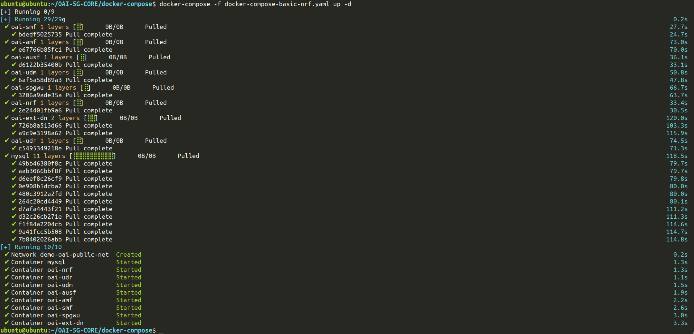

# OAI-5G-CORE
## Prerequisite:
* Suitable Docker-compose version for deploying `docker-compose-basic-nrf.yaml` file:
```bash
# Remove the existing Docker Compose binary (if any):
sudo rm /usr/local/bin/docker-compose

# Download the latest stable release of Docker Compose:
sudo curl -L "https://github.com/docker/compose/releases/latest/download/docker-compose-$(uname -s)-$(uname -m)" -o /usr/local/bin/docker-compose

# Apply execute permissions:
sudo chmod +x /usr/local/bin/docker-compose

# Verify the installation:
docker-compose --version
```


* For PLMN 00101, do [these](#in-oai-5g-core-we-have-to-configure-the-following-files) changes first:

#### In OAI-5G-CORE, we have to configure the following files:
- `/docker-compose/docker-compose-basic-nrf.yaml`
	- changing the version of images from `v1.5.0 --> develop`
	- ***changing MCC, MNC, SD, SST, TAC*** --> setting `MCC=001` and `MNC=01` is important.
	- ***adding Integrity/ciphering algorithms:*** `INT_ALGO_LIST` and `CIPH_ALGO_LIST` to secure the communication/(user data and signaling messages) between the UE and the 5G Core network.
	- changing default DNS
- `/docker-compose/docker-compose-basic-vpp-nrf.yaml`
	- changing the version of images from `v1.5.0 --> develop`


## Nework Architecture


## Deployment:
```bash
cd ~/OAI-5G-CORE/docker-compose/
docker-compose -f docker-compose-basic-nrf.yaml up -d
```

## Output:



> NOTE: Here is the list of all the changes that needs to be done on fresh OAI-5G-CORE

Check out [here](./docs/git-diff.md)